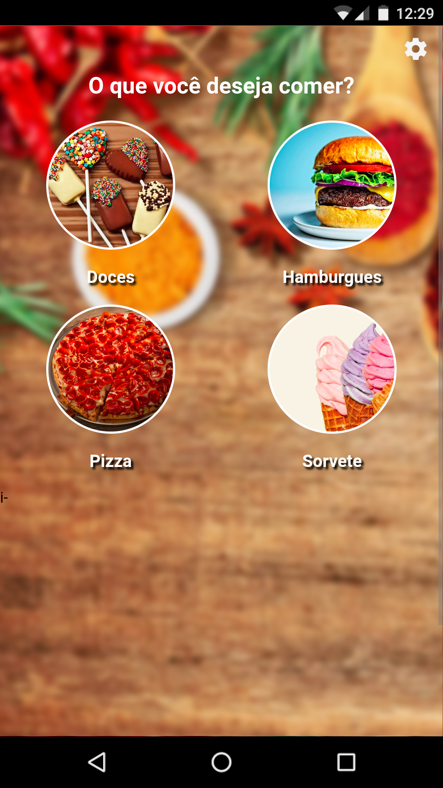

## Delifood
#### Aplicativo para pedidos de restaturante e IFOOD

  

    
  

- Versão 2.3 atual - Melhorias do design categorias e nas tabs.

- Versão 2.2 - Solução do erro na barra de status do    aplicativo, como também na redução da foto de perfil.

- Versão 2.1 - Soluções de erros em privacidade.

- Versão 2.0 - Melhorias no design do App e no banco de dados.

## Para instalar o projeto veja algumas orientações abaixos:

 - Precisa instalar o nodejs lts 10.24:
    baixe nodejs: https://nodejs.org/en/
 - Caso queira baixar nvm(gerenciador de versões para nodejs) tanto distros linux, macOS e windows: 
    - `Linux & macOS:` https://github.com/nvm-sh/nvm    
    - `Windows:` https://github.com/coreybutler/nvm-windows    

 - Logo após ter instalado nodejs, digite no terminal ou cmd:
    
    ``npm i`` 

 - Instale o ionic 3 e cordova 8:
 
   `npm i -g ionic@3.9.2 cordova@8.0`   
    
 - Depois digite: 
   
   ``ionic serve``

 - Para versão mobile Android: 
    
    ``ionic cordova run android`` 
    
 - Para versão mobile iOS:   
 
    ``ionic cordova run ios``

Mais informações no site do ionic framework: 
    https://ionicframework.com/docs
    